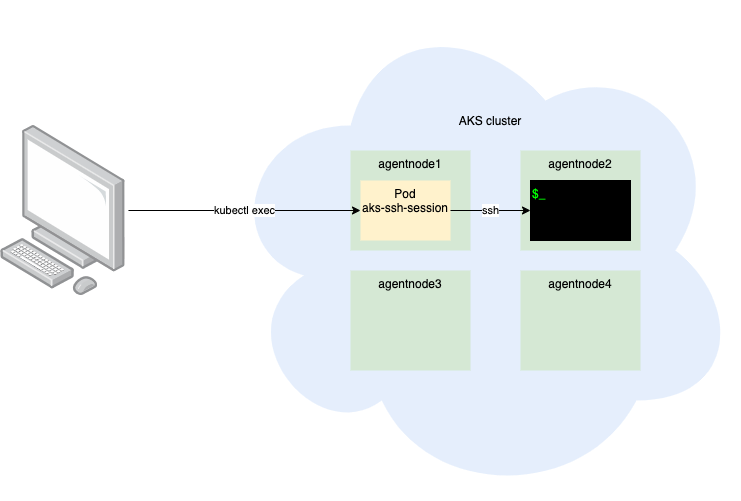

# SSH into AKS agent nodes

There is documentation on [how to SSH into AKS nodes (Microsoft docs)](https://docs.microsoft.com/en-us/azure/aks/ssh). That process is long and quite manual. This script automates this.

*Note: this script is currently in alpha and should not be used in a production environment.*

## Setup and dependencies

Clone this git repo and use the `az-aks-ssh.sh` direction (see below for usage).

Dependencies:

* [`az`](https://learn.microsoft.com/en-us/cli/azure/install-azure-cli-linux) (Azure CLI)
* [`kubectl`](https://learn.microsoft.com/en-us/cli/azure/aks?view=azure-cli-latest#az-aks-install-cli)

## Usage

```sh
./az-aks-ssh.sh --help
Usage:
  SSH into an AKS agent node (pass in -c to run a single command
  or omit for an interactive session):
    ./az-aks-ssh.sh \
        -g|--resource-group <resource_group> \
        -n|--cluster-name <cluster> \
        -d|--node-name <node_name|any> \
        [-p|--pod-name <pod_name>] \
        [-c|--command <command>] \
        [-o|--output-file <file>]

  Delete all locally generated SSH keys (~/.ssh/az_aks_*):
    ./az-aks-ssh.sh --clear-local-ssh-keys

  Delete the SSH proxy pod:
    ./az-aks-ssh.sh --delete-ssh-pod

  Cleanup SSH (delete SSH proxy pod and remove all keys):
    ./az-aks-ssh.sh --cleanup
```

> NOTE: `--resource-group` is read from `AZURE_DEFAULTS_GROUP` if not specified and that group is searched for a singleton AKS cluster to supply default values if possible.

## Examples

### SSH into any agent node in an interactive SSH session

```sh
./az-aks-ssh.sh -g rg1 -n aks1 -d any
```

### SSH into a specific agent node (get node name from `kubectl get nodes`)

```sh
./az-aks-ssh.sh -g rg1 -n aks1 -d cluster_node
```

### SSH into a specific agent node hosting a particular pod

```sh
./az-aks-ssh.sh -p mypod
```

### Run a single command non-interactively

```sh
./az-aks-ssh.sh -g rg1 -n aks1 -d any -c "ps -aux"
```

### Run a command non-interactively and save the output to a file

```sh
./az-aks-ssh.sh -g rg1 -n aks1 -d any -c "ps -aux" -o ~/aks-ssh.out
```

### Cleanup the environment (delete agent node SSH keys locally and remove the SSH proxy pod)

```sh
./az-aks-ssh.sh --cleanup
```

## More information

### Design



### SSH keys

The SSH keys are generated for individual nodes. This ensures that keys are not being reused for multiple hosts. `--cleanup` removes all keys that match the prefix: `~/.ssh/az_aks*`.

### SSH proxy pod

This design uses a proxy pod that sleeps forever so that it can be reused. `--cleanup` deletes this pod from the Kubernetes cluster. To see this pod you can run `kubectl get pod aks-ssh-session-{NodeName}`.
